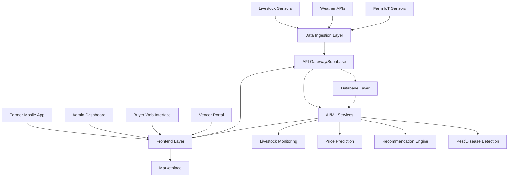
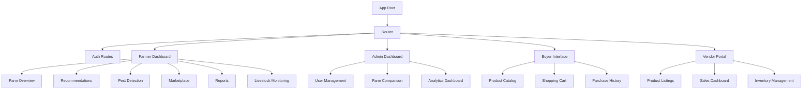
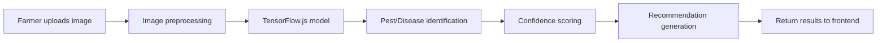
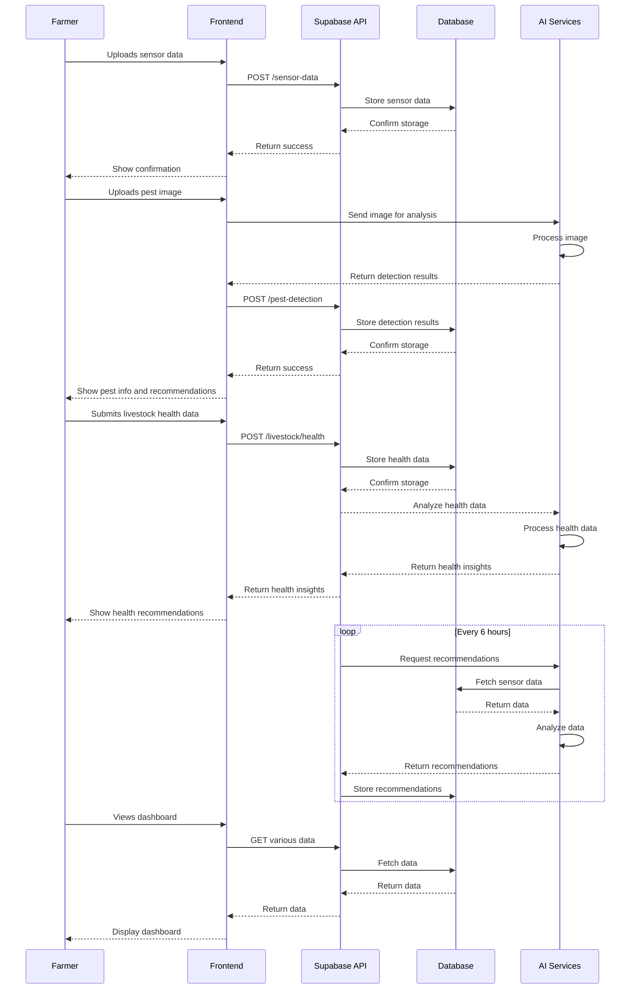
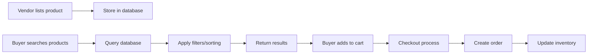

# Ulimi Smart Farming System - Design Document

## 1. Overview

Ulimi is a comprehensive smart farming management and advisory system that leverages AI to provide farmers with data-driven insights for crop management, livestock monitoring, pest and disease detection, marketplace integration, and performance reporting. The system will utilize IoT sensor data simulation, image recognition, and predictive analytics to deliver actionable recommendations to farmers while enabling a marketplace for agricultural products.

### 1.1 Objectives
- Provide AI-driven crop recommendations and irrigation schedules
- Monitor livestock health and behavior
- Detect pests and diseases using image recognition
- Enable a marketplace for farmers to sell produce
- Generate performance reports and comparative analytics
- Support multiple user roles with tailored interfaces

### 1.2 Technology Stack
- **Frontend**: React.js
- **Backend**: Node.js
- **Database**: Supabase (PostgreSQL with built-in authentication and real-time capabilities)
- **AI/ML**: TensorFlow.js for image recognition, custom recommendation algorithms
- **IoT Simulation**: Node.js services with mock data generation
- **Livestock Monitoring**: IoT sensors and computer vision for animal health tracking

## 2. Architecture



### 2.1 System Components

1. **Data Ingestion Layer**: Simulates IoT sensor data and collects environmental information
2. **Frontend Layer**: Multiple interfaces for different user roles (React.js)
3. **API Layer**: Supabase services handling authentication, database operations, and real-time updates
4. **AI/ML Services**: Specialized modules for image recognition, recommendations, price prediction, and livestock monitoring
5. **Database Layer**: PostgreSQL database managed by Supabase
6. **Marketplace**: E-commerce functionality for buying and selling agricultural products
7. **Livestock Monitoring**: Specialized system for tracking animal health and behavior

## 3. Frontend Architecture

### 3.1 Component Hierarchy



### 3.2 State Management
- **Context API** for global state management
- **React Query** for server state synchronization
- **Zustand** for complex local component states

### 3.3 Key Components

| Component | Description | Props |
|----------|-------------|-------|
| FarmDashboard | Main farmer interface | user, farmData |
| PestDetector | Image upload and analysis | onDetectionComplete |
| RecommendationPanel | Displays AI recommendations | recommendations, farmId |
| Marketplace | Product listing and purchasing | products, userRole |
| ReportGenerator | Performance analytics | farmId, dateRange |
| AdminPanel | User and farm management | users, farms |
| LivestockMonitor | Animal health and behavior tracking | livestockData, farmId |

## 4. Backend Architecture

### 4.1 API Endpoints

#### Authentication & User Management
```
POST /auth/register - Register new user
POST /auth/login - User login
GET /users/profile - Get user profile
PUT /users/profile - Update user profile
GET /users - Get all users (Admin)
```

#### Farm Data Management
```
POST /farms - Create new farm
GET /farms - Get all farms for user
GET /farms/:id - Get specific farm details
PUT /farms/:id - Update farm information
DELETE /farms/:id - Delete farm
```

#### Sensor Data
```
POST /sensor-data - Submit sensor readings
GET /sensor-data/:farmId - Get sensor data for farm
GET /sensor-data/:farmId/latest - Get latest readings
```

#### Pest & Disease Detection
```
POST /pest-detection - Submit image for analysis
GET /pest-detection/:farmId - Get detection history
```

#### Recommendations
```
GET /recommendations/:farmId - Get AI recommendations
POST /recommendations/feedback - Submit feedback on recommendations
```

#### Livestock Management
```
POST /livestock - Add new animal to farm
GET /livestock/:farmId - Get all livestock for farm
GET /livestock/animal/:id - Get specific animal details
PUT /livestock/animal/:id - Update animal information
DELETE /livestock/animal/:id - Remove animal from farm
POST /livestock/health - Submit health check data
GET /livestock/health/:animalId - Get health history
```

#### Marketplace
```
POST /products - Create product listing
GET /products - Get all products
GET /products/:id - Get specific product
PUT /products/:id - Update product
DELETE /products/:id - Delete product
POST /orders - Create order
GET /orders - Get user orders
```

#### Reporting
```
GET /reports/performance/:farmId - Get performance report
GET /reports/comparison - Get comparative report (Admin)
GET /reports/pest/:farmId - Get pest/disease report
GET /reports/livestock/:farmId - Get livestock health report
```

### 4.2 Data Models

#### User Model
```javascript
{
  id: string (UUID),
  email: string,
  name: string,
  role: enum ['farmer', 'buyer', 'vendor', 'admin'],
  phone: string,
  address: string,
  created_at: timestamp,
  updated_at: timestamp
}
```

#### Farm Model
```javascript
{
  id: string (UUID),
  name: string,
  location: string,
  size: number, // in acres/hectares
  crop_type: string,
  owner_id: string (foreign key to User),
  created_at: timestamp,
  updated_at: timestamp
}
```

#### Sensor Data Model
```javascript
{
  id: string (UUID),
  farm_id: string (foreign key to Farm),
  soil_moisture: number,
  temperature: number,
  humidity: number,
  ph_level: number,
  nitrogen: number,
  phosphorus: number,
  potassium: number,
  timestamp: timestamp
}
```

#### Pest/Disease Detection Model
```javascript
{
  id: string (UUID),
  farm_id: string (foreign key to Farm),
  image_url: string,
  detected_pest: string,
  confidence: number,
  recommendation: string,
  timestamp: timestamp
}
```

#### Product Model
```javascript
{
  id: string (UUID),
  name: string,
  description: string,
  price: number,
  quantity: number,
  vendor_id: string (foreign key to User),
  category: string,
  image_url: string,
  created_at: timestamp,
  updated_at: timestamp
}
```

#### Order Model
```javascript
{
  id: string (UUID),
  buyer_id: string (foreign key to User),
  product_id: string (foreign key to Product),
  quantity: number,
  total_price: number,
  status: enum ['pending', 'confirmed', 'shipped', 'delivered'],
  created_at: timestamp,
  updated_at: timestamp
}
```

#### Livestock Model
```javascript
{
  id: string (UUID),
  farm_id: string (foreign key to Farm),
  name: string,
  type: enum ['cattle', 'sheep', 'goat', 'pig', 'chicken', 'other'],
  breed: string,
  age: number,
  weight: number,
  health_status: enum ['healthy', 'sick', 'recovering', 'quarantined'],
  last_health_check: timestamp,
  next_vaccination: timestamp,
  created_at: timestamp,
  updated_at: timestamp
}
```

#### Livestock Health Data Model
```javascript
{
  id: string (UUID),
  animal_id: string (foreign key to Livestock),
  temperature: number,
  activity_level: number,
  food_intake: number,
  water_intake: number,
  notes: string,
  timestamp: timestamp
}
```

## 5. AI/ML Services Architecture

### 5.1 Pest and Disease Detection



#### Implementation Details
- **Model**: Custom CNN trained on agricultural pest/disease images
- **Framework**: TensorFlow.js for browser-based inference
- **Validation**: Cross-reference with sensor data for accuracy
- **Output**: Pest/disease identification with confidence score and treatment recommendations

### 5.2 Recommendation Engine

#### Data Sources
- Historical sensor data
- Weather forecasts
- Crop information
- Farm characteristics
- Historical yield data

#### Algorithms
- **Irrigation Scheduling**: Time series analysis of soil moisture data
- **Fertilizer Needs**: Nutrient level analysis and crop requirements
- **Crop Recommendations**: Based on climate, soil conditions, and market demand

### 5.3 Livestock Monitoring

#### Data Sources
- Activity sensors
- Temperature sensors
- Feeding and watering data
- Visual monitoring cameras
- Health check records

#### Approach
- **Computer Vision**: Detect abnormal behavior patterns
- **Anomaly Detection**: Identify health issues before symptoms appear
- **Predictive Analytics**: Forecast health risks and optimal breeding times
- **Recommendation Engine**: Provide feeding, healthcare, and management suggestions

### 5.4 Price Prediction

#### Data Sources
- Historical market prices
- Seasonal trends
- Supply and demand indicators
- Regional factors

#### Approach
- **Time Series Forecasting**: LSTM neural network for price prediction
- **Feature Engineering**: Seasonality, trends, and external factors
- **Prediction Horizon**: 7-day, 30-day, and seasonal forecasts

## 6. Data Flow



## 7. User Roles and Permissions

### 7.1 Admin
- Manage all users (create, update, delete)
- View and compare performance across farms
- Generate system-wide reports
- Monitor system health and usage

### 7.2 Farmer
- Manage farm information and sensor data
- Receive AI-driven recommendations
- Upload images for pest/disease detection
- List products in marketplace
- View personal performance reports

### 7.3 Buyer
- Browse and search products in marketplace
- Place orders and track purchases
- View purchase history
- Provide feedback on products

### 7.4 Vendor
- List products for sale
- Manage inventory
- View sales reports
- Update product information

## 8. Marketplace Integration

### 8.1 Features
- Product listing with images and descriptions
- Search and filtering capabilities
- Shopping cart functionality
- Order management
- Payment processing integration
- Price prediction integration for competitive pricing

### 8.2 Data Flow


## 9. Reporting and Analytics

### 9.1 Report Types

#### Farm Performance Report
- Yield predictions vs actual yields
- Resource utilization efficiency
- Cost analysis
- Environmental impact metrics

#### Pest/Disease Report
- Occurrence frequency
- Treatment effectiveness
- Seasonal patterns
- Prevention recommendations

#### Marketplace Report
- Sales performance
- Popular products
- Pricing analysis
- Customer feedback

#### Livestock Report
- Health status overview
- Disease occurrence tracking
- Growth rate analysis
- Feeding efficiency metrics

#### Admin Comparative Report
- Performance comparison across farms
- System utilization statistics
- User engagement metrics
- Regional analysis

### 9.2 Dashboard Components
- Real-time sensor data visualization
- Recommendation history
- Pest/disease occurrence charts
- Livestock health monitoring
- Marketplace performance graphs
- Comparative analytics widgets

## 10. Security Considerations

### 10.1 Authentication
- Email/password authentication via Supabase Auth
- Role-based access control
- Session management

### 10.2 Data Protection
- Encryption at rest for sensitive data
- HTTPS for all communications
- Row-level security policies in Supabase
- Regular database backups

### 10.3 API Security
- Rate limiting
- Input validation and sanitization
- Authentication tokens for API access
- CORS configuration

## 11. Testing Strategy

### 11.1 Unit Testing
- React components with Jest and React Testing Library
- Backend services with Mocha/Chai
- AI models with dedicated test datasets

### 11.2 Integration Testing
- API endpoint testing with Supertest
- Database integration tests
- End-to-end data flow validation

### 11.3 User Acceptance Testing
- Role-based functionality testing
- Cross-browser compatibility
- Mobile responsiveness testing
- Performance testing under load

## 12. Implementation Plan

### 12.1 Phase 1: Core Infrastructure (Weeks 1-2)
- Set up Supabase project with authentication
- Create database schema for Users, Farms, and basic data models
- Implement basic API endpoints for user management and farm data
- Create React project structure with routing for different user roles

### 12.2 Phase 2: Data Ingestion & Monitoring (Weeks 3-4)
- Implement IoT sensor data simulation
- Create dashboard components for real-time sensor data visualization
- Develop data ingestion APIs for sensor readings
- Build basic farm overview dashboard

### 12.3 Phase 3: AI Services & Recommendations (Weeks 5-6)
- Implement pest and disease detection AI model
- Create recommendation engine for crops
- Develop price prediction algorithms
- Integrate AI services with frontend dashboard

### 12.4 Phase 4: Livestock Management (Weeks 7-8)
- Implement livestock data models
- Create livestock monitoring dashboard
- Develop health tracking features
- Integrate livestock AI monitoring services

### 12.5 Phase 5: Marketplace & Reporting (Weeks 9-10)
- Implement product listing and marketplace features
- Create reporting and analytics dashboards
- Develop comparative reporting for admin users
- Implement data visualization components

### 12.6 Phase 6: Testing & Deployment (Weeks 11-12)
- Conduct thorough testing of all components
- Optimize performance and fix bugs
- Set up production deployment
- Create user documentation and guides

## 13. Development Environment Setup

### 13.1 Prerequisites
- Node.js (v16 or higher)
- npm or yarn package manager
- Supabase account
- Git for version control
- Code editor (VS Code recommended)

### 13.2 Project Structure
```
ulimi-smart-farming/
├── client/                 # React frontend
│   ├── public/
│   ├── src/
│   │   ├── components/     # Reusable UI components
│   │   ├── pages/          # Page components for routes
│   │   ├── services/       # API service integrations
│   │   ├── utils/          # Utility functions
│   │   ├── hooks/          # Custom React hooks
│   │   └── assets/         # Images, styles, etc.
│   └── package.json
├── server/                 # Backend services (if needed)
│   ├── functions/          # Supabase edge functions
│   └── package.json
├── ai-models/              # AI/ML models
│   ├── pest-detection/
│   ├── recommendation-engine/
│   └── price-prediction/
├── docs/                   # Documentation
└── README.md
```

## 14. Getting Started

### 14.1 Setting up Supabase
1. Create a new project at https://app.supabase.com
2. Note your project URL and anon/public keys
3. Set up authentication providers
4. Create database tables using the SQL editor

### 14.2 Frontend Development
1. Create a new React app: `npx create-react-app client`
2. Install required dependencies:
   ```
   npm install @supabase/supabase-js
   npm install react-router-dom
   npm install recharts  # for data visualization
   npm install @mui/material  # for UI components
   ```
3. Configure Supabase client in your React app
4. Implement authentication flows
5. Create dashboard components

### 14.3 AI Services Development
1. For pest detection, consider using TensorFlow.js:
   ```
   npm install @tensorflow/tfjs
   npm install @tensorflow-models/mobilenet
   ```
2. For recommendation engine, implement custom algorithms or use ML libraries
3. For price prediction, consider using libraries like:
   ```
   npm install ml-regression
   npm install ml-timeseries
   ```

## 15. Deployment Architecture

### 15.1 Hosting
- **Frontend**: Vercel or Netlify
- **Backend**: Supabase platform
- **AI Services**: Edge functions or dedicated ML hosting
- **Storage**: Supabase Storage for images and files

### 15.2 CI/CD Pipeline
- GitHub Actions for automated testing
- Automated deployment to staging
- Manual approval for production deployment
- Database migration management

### 15.3 Monitoring and Logging
- Supabase built-in monitoring
- Error tracking with Sentry
- Performance monitoring
- User analytics with PostHog or similar